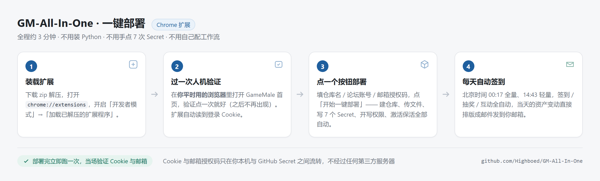
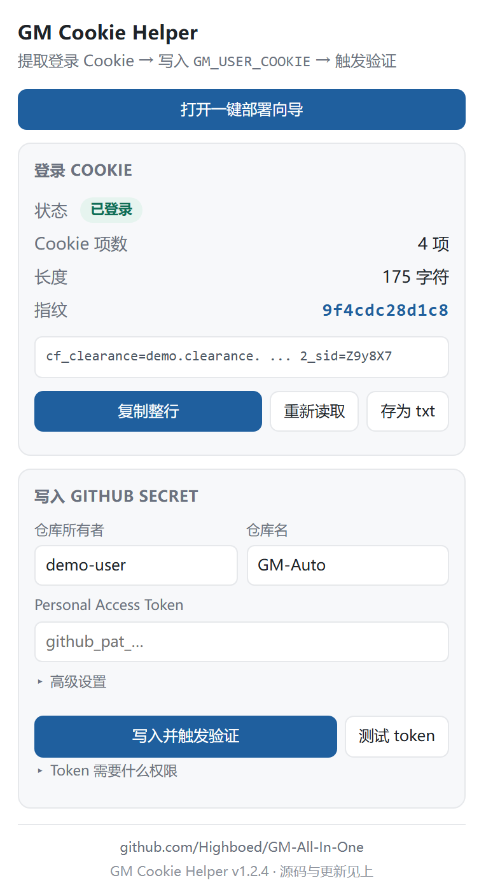
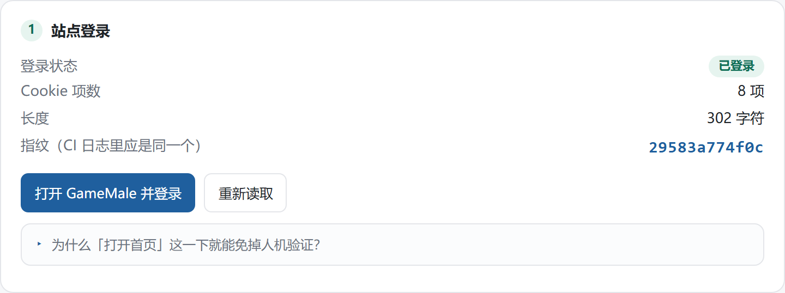
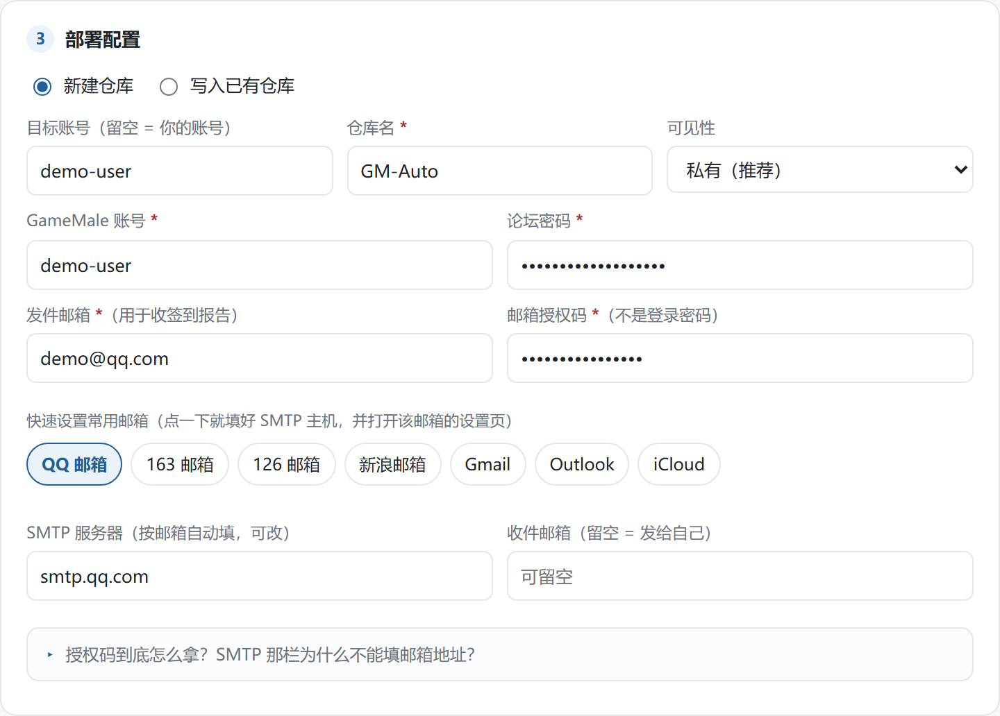
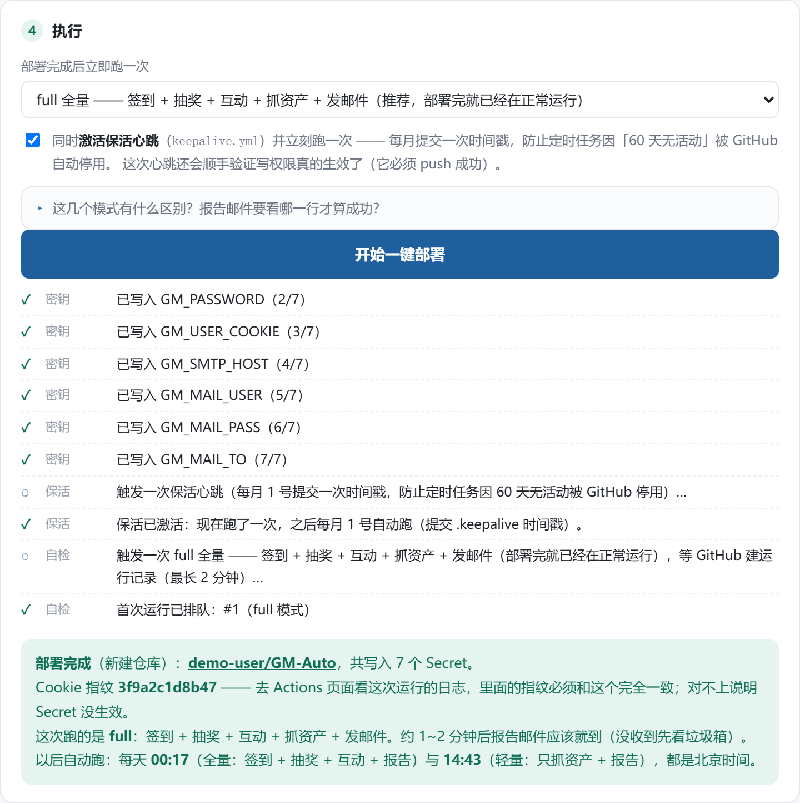

# GM-All-In-One Gamemale论坛签到一条龙


这是一个用于 GameMale 论坛的纯后台自动化挂机脚本。
配置好之后，它每天会定时帮你完成签到、抽奖、互动等全部日常，并把当天的签到情况与资产变动排版成邮件发给你。

**部署方式有两种，强烈建议用第一种。**

---

## ⚡ 一键部署（推荐 · 约 3 分钟 · 不用装 Python）

装一个浏览器扩展，剩下的它全做完：建仓库、传文件、写 Secret、开权限、激活保活、跑第一次签到。



### 它到底替你省掉了什么

| 手动部署里的一步 | 一键部署 |
| :-- | :-- |
| Import 仓库、勾 Private、等导入 | ✅ 自动建仓库（默认私有） |
| 逐个粘贴 5~7 个 Secret | ✅ 自动写入全部 7 个（含刚取到的 Cookie） |
| 去 Settings 里设 `Read and write` | ✅ 自动设置（漏了会让金币永远是 `+0`，且不报错） |
| 手动去 Actions 点 Run workflow | ✅ 自动触发，并帮你等到运行记录出现 |
| 记得去激活保活工作流 | ✅ 自动 Enable + 立刻跑一次 |

### 第一步：装载扩展

1. 下载 **[gm-cookie-helper.zip](https://github.com/Highboed/GM-All-In-One/releases/latest/download/gm-cookie-helper.zip)**，解压到一个固定目录（比如 `D:\GM-Cookie-Helper`，**别放在临时目录**，扩展加载后依赖这个路径）。
2. 浏览器地址栏输入 `chrome://extensions`，打开右上角的 **开发者模式**。
3. 点 **加载已解压的扩展程序**，选中刚才解压出来的那个文件夹。
4. 装好后点扩展图标，面板长这样：



> 想把 Cookie 写进**已经存在**的仓库（而不是新建一个）也可以，面板里的「高级设置」就是为这种情况准备的。

### 第二步：过一次人机验证（全流程唯一需要动手的一下）

在**你平时登录论坛的这个浏览器**里打开 [gamemale.com](https://www.gamemale.com/) 首页，把 Turnstile 验证点掉（只有第一次会出现），保持登录状态。

扩展会自动读到登录 Cookie，面板的「登录状态」变成**已登录**、并算出 12 位指纹，就说明拿到手了：



> **为什么这一下就够了？** 本站挂了人机验证插件，但它把搜索引擎爬虫 UA 整站放行。
> 于是「你浏览器的登录 Cookie + 爬虫 UA」就能完全绕开验证 —— 前提是 Cookie 得由真浏览器产生，
> 这正是扩展存在的理由。之后 CI 侧 **0 次验证**，每天自动跑都不需要你出现。

### 第三步：点「开始一键部署」

点扩展面板顶部的 **打开一键部署向导**，按页面上的 1→2→3→4 走：



- **站点登录**：扩展自动完成（第二步做过就是绿的）。
- **GitHub 授权**：点「去创建 Token」会带着正确的权限范围打开 GitHub 页面，创建后粘回来。Token 只存在这个页面内存里，刷新即清空。
- **部署配置**：仓库名、论坛账号密码、发件邮箱 + 授权码。SMTP 服务器**不用自己查** —— 点一下「快速设置常用邮箱」里的按钮（QQ / 163 / 126 / 新浪 / Gmail / Outlook / iCloud），主机名自动填好。
- **执行**：默认 **`full` 全量**（签到 + 抽奖 + 互动 + 报告），保活勾选框默认勾上。

点 **开始一键部署**，日志会一条条滚过去；最后一步要等 GitHub 建运行记录，页面有进度条，**最长等 2 分钟**：



看到绿色那一段就成了。**约 1~2 分钟后报告邮件到邮箱**（没收到先翻垃圾箱）。

> **指纹对账**：结果里的 12 位指纹，必须和 CI 日志里打印的完全一致。
> 对不上说明 Secret 没生效，不用猜别的原因。判据永远是日志里的 `推送邮件发送成功` ——
> **邮件发失败不会让 job 变红**，只有日志能看出来。

<details>
<summary><b>它安全吗？我的密码和 Cookie 去哪了？</b></summary>

- 扩展只向 `api.github.com` 发请求，**没有中间服务器**；Cookie 与邮箱授权码直接从你的浏览器写进你自己仓库的 Secret。
- Token、论坛密码、邮箱授权码**只存在向导页面的内存里**，不写浏览器存储，刷新即清空；只有仓库名、论坛用户名、发件邮箱这类非敏感字段会被记住，省得重复填。
- 扩展本身只有 `cookies` 与 `storage` 两个权限，代码完全开源（不放心就自己读一遍）。
- 取 Cookie 时用的是你**已经登录的浏览器会话**，不是模拟登录，不会触发风控。

</details>

<details>
<summary><b>「打开首页」这一下到底做了什么？为什么老流程每次都要过验证？</b></summary>

站点在 Discuz 上挂了人机验证插件，浏览器第一次进站要过一道 Turnstile。
在**你日常用的这个浏览器**里过掉它之后，站点会把放行凭据（`cf_clearance`）存在这个会话里，
之后再进任何页面都不用再过 —— 包括登录页。

老流程（`get_user_cookie.py`）之所以每次都必过一道验证，是因为它**新拉一个干净的 Chrome 配置目录**，
里面没有任何放行凭据。换成本扩展后，「打开首页」这一下就是全流程唯一可能出现的验证，
而且它发生在你已经登录惯了的浏览器里。CI 那一侧是 **0 次**。

</details>

<details>
<summary><b>一键部署之后，还需要我做什么吗？</b></summary>

不用了。部署完成后：

| 时间（北京时间） | 跑什么 |
| :-- | :-- |
| 每天 **00:17** | `full` 全量：签到 + 抽奖 + 互动 + 抓资产 + 报告邮件 |
| 每天 **14:43** | `light` 轻量：破门 → 登录 → 抓资产 → 报告邮件（零写操作） |
| 每月 **1 号** | 保活心跳：提交一次时间戳，防止 GitHub 因 60 天无活动停掉定时任务 |

Cookie 有效期约 30 天，过期后扩展面板会显示「未登录」，回到**第二步**重新读一次即可。
</details>

---

## 🛠 手动部署（不使用扩展）

下面这套是「不装扩展、纯网页操作」的完整流程，步骤更多但一样能跑通。
**如果你已经用上面的方式部署好了，这一节可以整段跳过。**

整个部署过程大概需要 3 分钟，只需要在 GitHub 网页上点几下，不需要你自己有服务器。

### 第一步：Import 项目并设置为私有（⚠️ 保护账号隐私的关键）

登录 GitHub，点击页面右上角的 + 号图标，在下拉菜单中选择 Import repository（导入仓库）。  
在第一栏 Your old repository’s clone URL 中，填入本项目的地址：  
`https://github.com/Highboed/GM-All-In-One`  
在 Repository name 这一栏，为你的仓库起个名字（比如 GM-Auto）。  
在下方的 Privacy 选项中，必须勾选 Private（私有）！点击最下方的绿色按钮 Begin import。等待十几秒转圈结束，提示导入成功后，点击进入你的新仓库。


### 第二步：获取发件邮箱授权码
为了让脚本能给你发邮件通知，你需要一个发件邮箱（比如 QQ 邮箱）。
1. 登录 QQ 邮箱网页版，进入 `设置` -> `账号与安全`。
2. 往下翻找到 `POP3/IMAP/SMTP/Exchange/CardDAV/CalDAV服务`。
3. 开启 **SMTP 服务**，点击“生成授权码”，把弹出的那一串十多位的字母密码**复制保存下来**（不要告诉别人）。


### 第三步：填入账号密码配置
回到你的 GitHub 仓库页面，进入 `Settings` -> 左侧找 `Secrets and variables` -> 点 `Actions`。
点击绿色的 **New repository secret** 按钮，只需要添加以下 **5个核心变量** 即可：

| 变量名 (Name) | 填什么 (Secret) |
| :--- | :--- |
| `GM_USERNAME` | 你的 GameMale 论坛账号名 |
| `GM_PASSWORD` | 你的论坛登录密码 |
| `GM_SMTP_HOST` | 填入你发件邮箱对应的服务器地址（**参考下方对照表**） |
| `GM_MAIL_USER` | 你的发件邮箱（比如 123456@qq.com） |
| `GM_MAIL_PASS` | **刚才第二步获取的那一串字母授权码** |

*(注：如果你想把报告发给别的邮箱，可以额外添加一个 `GM_MAIL_TO` 变量填入接收方的邮箱。如果不填，则默认发给自己。)*

> 兼容说明：旧的 `USERNAME` / `PASSWORD` / `SMTP_HOST` / `MAIL_USER` / `MAIL_PASS` 变量名仍然被识别，不必改动已有的仓库配置。


---

### 第三步补：过验证门（**这一步才决定能不能真正跑起来**）

站点装了一个人机验证插件（Turnstile），它会把你几乎所有的访问都拦在验证页后面。
**光配账号密码是跑不起来的** —— 你会看到 `缺少账号配置` 之类的报错，或者卡在门口。

代码里给了三条路，按推荐度排序：

| 路线 | 需要配的 Secret | 说明 |
| :--- | :--- | :--- |
| **A（强烈推荐）** | `GM_USER_COOKIE` | 你自己浏览器的登录 Cookie + 爬虫 UA。**完全不碰 Turnstile、不需要验证码、不开浏览器** |
| B | `CAPSOLVER_KEY` | 打码平台自动解 Turnstile（付费，约 $0.001/次，全自动） |
| C | 什么都不用配 | Workflow 用 `xvfb` 起有头 Chrome 现场过门 —— **兜底，最不稳（受出口 IP 信誉影响）** |

#### 路线 A：取你自己的登录 Cookie（30 秒）

```powershell
# 本地执行（需要先 pip install -r requirements.txt）
python get_user_cookie.py
```

会弹出一个 Chrome 窗口，你**正常登录** GameMale（要过验证就点一下）。
脚本检测到登录成功后会打印一整行 Cookie 串，并存到 `user_cookie.txt`。
把它存成新的仓库 Secret：

| 变量名 (Name) | 填什么 (Secret) |
| :--- | :--- |
| `GM_USER_COOKIE` | 上面打印的那一整行（形如 `TVj0_2132_auth=…; TVj0_2132_saltkey=…; …`） |

不想用脚本也行：在自己浏览器里登录后按 `F12` → 网络(Network) → 点任意一个
gamemale.com 请求 → 复制请求头里 `Cookie:` 后面那一整串，同样存成 `GM_USER_COOKIE`。
有效期约 30 天，过期后重新取一次即可。

脚本最后会**当场用爬虫 UA + 这行 Cookie 发一次真实 HTTP 请求验证**，确认服务端认这个登录态。
只有看到 `[验证通过] 服务端认这个登录态` 才算拿到可用的串。

#### 🔑 用「指纹」确认 Secret 真的生效（强烈建议）

脚本会打印一个 12 位指纹，例如：

```
长度/指纹  : 1380 / c4fa17e6446d
```

CI 日志里会打印**同一个指纹**。两处对不上，就说明 Secret 没生效，不用再猜：

| CI 日志里的表现 | 含义 |
| :--- | :--- |
| `GM_USER_COOKIE: 长度=0 指纹=(空)` | Secret 没配 / 名字写错 / 该步骤没注入 env |
| 指纹与本地不一致 | 粘贴被截断或夹带了多余字符 |
| 指纹一致但 `已失效` | 这串真的过期了（或改过密码），重新取一串 |

也可以本地先验一遍（不会开浏览器，几秒钟）：

```powershell
$env:GM_USER_COOKIE="粘贴那一整行"
python gm_gate.py --verify-cookie
```

Workflow 里已经内置了一个 **Verify User Cookie** 步骤：配了但不可用会**直接让 job 变红**
（否则要白等几分钟才能从一堆日志里找出原因）。

#### ❌ 别再依赖 `GM_GATE_COOKIE`（破门导出的放行 Cookie）

早期版本让你 `python gm_gate.py --solve --export` 破门一次导出 Cookie 存起来。
**实测这条路不可靠**：放行 Cookie 的寿命只有几小时（15:22 导出、18:25 已失效），
而且它跟出口 IP / UA 绑定，本地导出的串拿到 GitHub Runner 上大概率无效。
代码仍兼容这个变量，但**请优先配 `GM_USER_COOKIE`**。

#### ⚠️ 「让 CI 自己过 Turnstile」：能成功，但不稳定

Workflow 里保留着 `xvfb` + 有头 Chrome 的兜底。它的真实成功率是这样的：

早期（点击定位还有 bug 时）连续两轮卡在 `interaction_required`，
日志里从头到尾**没有一行「已点击 Turnstile 复选框」** —— 当时误判成「机房 IP 必被降级」。
把点击定位修好（多级 iframe / shadowRoot 兜底 + 三策略）之后，CI 实测**真的能过**：

```
11:20:02 | Turnstile 状态: idle | 页面提示: www.gamemale.com需要首先检查您的连接安全性。
11:20:05 | Turnstile 状态: interaction_required | 页面提示: 请完成上方人机验证
11:20:06 | 已点击 Turnstile 复选框 (470, 403) ｜ 匹配=container ｜ 位置 (440, 369) 400x69
11:20:09 | 验证门已通过（页面标题: GameMale - 最新游戏MOD资源交流论坛…）
11:20:09 | HTTP 引擎复验通过（HTTP 200, 164327 字节）
```

但要清楚它**不是必成功**：Turnstile 按出口 IP 信誉动态给分，
同一台机器同一天都出现过「8 秒零点击通过」和「三轮全失败」两种极端。

所以兜底成本压到了 `1 次 × 75 秒`（`GM_BROWSER_ATTEMPTS` / `GM_SOLVE_TIMEOUT`）：
成功就继续跑业务，失败也立刻给出可读结论，不再干等 5 分钟。
想要**每天稳定成功**，还是请配 `GM_USER_COOKIE`。

> **为什么 `GM_USER_COOKIE` 能整个绕开 Turnstile？**
> 站点插件把搜索引擎爬虫 UA（Baiduspider / Googlebot / Bingbot …）**整站放行** ——
> 实测连 POST 写操作都放行，**只有 `misc.php`（登录验证码图片在其中）被 403 封死**。
> 既然登录态由 Cookie 提供、根本不需要验证码，那整条链路就完全不必过门。

#### 自动降级顺序与失败行为

`GM_USER_COOKIE` → `GM_GATE_COOKIE` → 打码平台 → 有头浏览器（1 次 × 75 秒）→ 明确报错退出。

- 配了 `GM_USER_COOKIE` 但不可用 → **立刻中止**，不会再去开浏览器白烧时间；
- 没配 `GM_USER_COOKIE` → 日志里给一条显眼的 warning，然后按上面顺序兜底；
- 破门失败的现场快照会写进 `gate_debug.txt`，随 Artifact 一起上传，方便定位。

---

#### 💡 附：常用邮箱 `SMTP_HOST` 对照表
脚本默认使用安全的 465 加密端口，请根据你的发件邮箱类型，直接复制下方对应的服务器地址填入 `SMTP_HOST`：

| 邮箱类型 | 对应的 `SMTP_HOST` 地址 |
| :--- | :--- |
| **QQ 邮箱** | `smtp.qq.com` |
| **网易 163 邮箱** | `smtp.163.com` |
| **网易 126 邮箱** | `smtp.126.com` |
| **新浪邮箱** | `smtp.sina.com` |
| **Foxmail** | `smtp.foxmail.com` |
| **Gmail (谷歌邮箱)** | `smtp.gmail.com` |
| **阿里云邮箱** | `smtp.aliyun.com` |


> ⚠️ **`SMTP_HOST` 填的是主机名，不是邮箱地址**。
> 把 `123456@qq.com` 粘进这一栏会让 `smtplib.SMTP_SSL('123456@qq.com', 465)` 直接 DNS 解析失败，
> 表现是「任务跑成功、但永远收不到邮件」，而且日志里只有一行 error（邮件失败不会让 job 变红）。

### 第四步：给脚本开放写入权限（防断签）
为了让脚本能把每天的金币数量保存下来做对比，以及防止 GitHub 自动休眠你的任务，必须开放权限。
1. 进入 `Settings` -> 左侧选 `Actions` -> 点 `General`。
2. 滑到最底部的 `Workflow permissions`，选中 **Read and write permissions**。
3. 点击 **Save** 保存。


### 第五步：一键激活运行
1. 点击仓库顶部的 **Actions** 选项卡。
2. 如果看到提示，点击绿色的 `I understand my workflows, go ahead and enable them` 允许运行。
3. 在左侧菜单点击 `GameMale Auto Sign-in`。
4. 点击右侧灰色的 **Run workflow** 手动触发第一次运行。
5. 等待大概几十秒，看到绿色的打勾，就可以去邮箱查收你的第一份资产看板了！以后每天它都会在云端自动打卡。

### 第六步：别忘了保活工作流（不激活的话定时任务会静默失效）

左侧菜单里还有一个 **Keep Alive**，它负责每月提交一次时间戳，
破掉 GitHub「仓库 60 天无活动就暂停 Actions」的限制。**很多人的定时任务某天开始不再执行，
原因就是它被停用了，而且不报错。** 点进去选 Enable workflow，再跑一次就行。

> 一键部署会自动做掉这一步（Enable + 立刻跑一次），手动部署的话建议照做。

---

### 第七步（可选）：别人克隆/复刻了这个仓库怎么办？

基准文件（`asset_record.json` / 旧版 `gold_record.txt`）是**要提交进仓库**的 ——
否则 GitHub Actions 每次都是全新环境，没法跟昨天对比。代价是：别人克隆你的仓库时，
会把你的资产基准一起克隆走，第一次运行就显示一个莫名其妙的大额涨跌：

```
（克隆者其实只有 200 金币）→ 💰 金币: 200 （较上次 -1549）   ← 拿作者的 1749 当了基准
```

**v1.1 起已内置防护**：基准文件里附带一组**当前账号的指纹**（只存哈希、不含明文；
盐是公开的，所以它只负责「归属比对」，不承担保密职责）。读取时对不上，就整份忽略、
全部按「首次记录」处理，日志里会明确写出原因。所以：

| 你的身份 | 第一次运行会看到 | 需要做什么 |
| :-- | :-- | :-- |
| 仓库作者本人 | 正常显示「较上次 ±N」 | 什么都不用做 |
| 克隆 / 复刻的人 | 三项都显示「（首次记录）」 | 什么都不用做，从第二次起就是自己的数据 |

想主动清空基准（例如换了账号）：

```bash
python gamemale.py --reset-record    # 不需要账号密码、不联网
```

> ⚠️ **别用「手动把文件清空再上传」这个办法**，它解决不了问题：
> ① 清空 `asset_record.json` 后，脚本会退回读 `gold_record.txt`，而那里面同样是你的数据；
> ② 下一次定时运行就会把真实数值写回来，并自动提交 —— 等于白清。
> 归属指纹（而不是删文件）才是真正的解。

> **为什么不改用 Actions Cache 把数值藏起来？** 因为收益有限、风险不小：
> `gold_record.txt` 已有 94 次自动提交，翻 git 历史照样能读出每天的数值（要清干净得重写历史，
> 会毁掉所有 fork）；而 cache 的定位本就是「丢了也无所谓」—— 官方明确**7 天不访问即回收**，
> 且未命中时**不报错**，不适合当状态存储。详见修复报告 12.6。

---

## ✨ 它到底能干什么？ (功能特性)

本脚本全面摒弃了模拟浏览器的慢速方案，所有操作直接对接论坛底层 API，执行速度极快且稳定：
* **全日常覆盖**：自动执行基础签到、插件抽奖、空间串门(3次)、打招呼(3次)、日志吃瓜表态(10次)。
* **你画我猜 API 化**：通过提交极简的隐形像素图，实现 100% 纯后台静默出题，绕过前端验证限制。
* **资产看板与对比**：每次运行后剥离干扰代码，精准抓取金币、血液、灵魂等硬通货，**并自动对比上次数据，算出「金币 / 血液 / 积分」三项增减**。
* **积分与等级追踪（v1.1 新增）**：自动读取总积分并换算等级（`Lvl. N`），还能估算**「再献祭多少血液就能升到下一级」**（1 积分 ≈ 34 血液）。
* **基准文件归属隔离（v1.1 新增）**：基准文件带当前账号的不可逆指纹，克隆/复刻本仓库的人**不会**把你的金币/血液/积分当成他昨天的数据（否则第一份报告会出现一个虚假的大额涨跌），也不需要他手动删文件。
* **高安全性**：代码已做深度脱敏，所有动态 Token（如 formhash）阅后即焚，绝不打印在日志中。
* **自带防休眠**：内置保活工作流，每月自动更新时间戳，破解 GitHub 连续 60 天无活动自动暂停 Actions 的限制。
* **浏览器扩展一键部署（v1.2.5 新增）**：见文首，把「Import + 手填 Secret + 设权限 + 激活」四件事合成一个按钮。

---

## 🆕 更新记录

### v1.2.5（2026-09-25）· 部署体验

| # | 变化 | 说明 |
| :-- | :-- | :-- |
| 1 | **浏览器扩展一键部署** | 装扩展 → 过一次验证 → 点一个按钮，建仓库/写 Secret/开权限/激活保活全自动 |
| 2 | 首次运行默认 `full` | 部署完立刻就在正常运转，不必等下一次定时任务；邮件同时验证 Cookie 与邮箱通路 |
| 3 | 保活自动激活 | 自动 Enable `keepalive.yml` 并立刻跑一次（仓库级总开关管不了「单个工作流被停用」） |
| 4 | SMTP 常用邮箱快速入口 | 一键填好主机名并打开该邮箱的设置页，附「点哪几层菜单拿授权码」 |
| 5 | 长解释折叠 + 进度条 | 首屏只留动作与必填项；等待运行记录时有含秒数的进度条（上限 2 分钟） |
| 6 | 文档配图 | 本页顶部的流程图与各步骤截图（`docs/images/`） |

> 扩展源码与使用说明见扩展目录里的 `README.md`。扩展的「一键部署」复制文件时会**跳过 `docs/`**，
> 所以你的仓库不会带上这一堆文档配图。

### v1.1（2026-09-23）

| # | 变化 | 说明 |
| :-- | :-- | :-- |
| 1 | 邮件恢复 emoji | 资产看板重新带上 💰 🩸 ✈️ 👣 📚 🔮 🖤 👻，一眼看清 |
| 2 | 署名改版 | 邮件末尾署名改为 **`GM-All-In-One v1.1`**，作为第一次更新的版本记录 |
| 3 | 血液也做对比 | 从「只有金币」扩展为 **「金币 + 血液 + 积分」都显示较上次增减** |
| 4 | 积分与等级 | 显示 🏅 积分 与 🎖️ `Lvl. N` |
| 5 | 献祭升级估算 | 算出距下一级还需多少积分，并折算成**需要献祭多少血液** |
| 6 | 基准文件归属隔离 | 别人克隆/复刻后不会继承你的资产基准（见上方「第七步」） |
| 7 | 日志表态口径修正 | 「今天已表过态」不再被误报成失败（详见下条） |
| 8 | Artifact 隐私收敛 | 日志/产物里不再出现完整收件邮箱与全部 Cookie 名单 |

**首次运行不会报错**：没有历史基准时显示「（首次记录）」，不会崩也不会写出脏数据。
基准文件从 `gold_record.txt`（纯数字）升级为 `asset_record.json`（含日期与多项数据），
旧文件仍会被读取一次，迁移不丢基准。
另外，**空的 / 损坏的基准文件不会再连带吃掉旧文件里的基准**（早先 `if/elif` 写法会导致
一个 0 字节的 JSON 就让金币对比凭空消失），并新增 `--reset-record` 一键清空。

#### 日志表态为什么会出现 `(10/10 · 本次无新增)`

站点对「今天已经表过态」的回复是「**您已表过态**」——那是**完成**，不是失败。
早先只数「成功」，于是同一天重复运行会把已经做完的显示成 `(1/10)`，看着像任务挂了。
现在会区分两者：当天第一次跑是 `日志表态(10/10)`，之后再跑就是
`日志表态(10/10 · 本次无新增)`，并在日志里写明「另有 N 篇今天已完成」。

> 顺带一句：**`full` 模式一天跑一次就够**。重复跑的意义不大，还会徒增风控暴露面；
> 想手动试，请用 `Run workflow` 的 `check` 或 `light` 模式。

#### 🔒 Artifact 是公开可下载的，所以日志必须自己打码

公开仓库的 Actions Artifact，任何登录 GitHub 的人都能下载。而 **GitHub 的密钥打码
只作用于网页日志的显示层** —— `tee run.log` 写出的文件是**原文**。
所以：日志里的收件人邮箱已自动打码（`292***09@qq.com`），
`--verify-cookie` 也只报 Cookie 数量与关键项，不再打印完整名单
（完整名单需要 `python gm_gate.py --verify-cookie --verbose` 在本地看）。

邮件长什么样？仓库里的 `mail_preview_v1.1.html` 是用真实的 `build_mail_content()`
渲染的四份样例（正常日报 / 同日再跑一次 / 第一天 / 积分解析失败降级），
直接用浏览器打开即可对照。

> **关于等级门槛**：`LEVEL_THRESHOLDS` 定义在 `gamemale.py` 顶部。
> 你提供的 lv4 写作 14，与「门槛单调递增」冲突（14 < 35），代码里按 `70` 处理。
> 它只影响「积分落在 35~120 之间时显示的等级」，若与站内实际不符，直接改那一行即可。

---

## 🤝 致谢

本项目的诞生离不开社区前辈的开源精神，核心逻辑与灵感参考了以下开发者的工作：
* 特别感谢 **@thh866** 提供的最初 Actions 自动化触发流与部署思路。
* 感谢 **exact-emote-granny/Gizmo** 项目在日志隐私脱敏策略以及日常抽奖模块上的启发。
